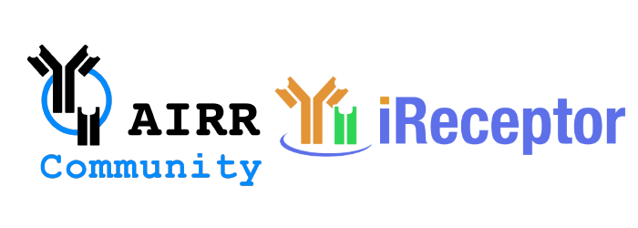

# Adaptive ImmunoSeq Repository

(a.k.a. AIRR-seq Adaptive Adapter) 

Team Members (by last name)

- Brian Corrie
- Michael R. Crusoe, VU Amsterdam, DTL Projects (ELIXIR-NL)
- Laura Gutierrez Funderburk, Simon Fraser University, Department of Mathematics
- Nicole Knoetze, University of British Columbia, Bioinformatics Department
- Artem Kushner, University of British Columbia, Mathematics Deptartment
- Akiff Manji

Project video below.

## About the Project

Microsoft and Adaptive Biotechnologies are [exploring how the immune system responds to C0VID-19](https://www.cnbc.com/2020/03/20/microsoft-adaptive-studying-coronavirus-immune-system-reaction.html). As part of this project, they are gathering data from the Adaptive Immune Receptor Repertoire (AIRR-seq data) from COVID-19 patients. The AIRR-seq data from this study will be stored in Adaptive's publicly available [ImmunoSeq repository](https://clients.adaptivebiotech.com/login). In order to make this data more broadly accessible, there is a need to convert this data from the Adaptive metadata format to standard AIRR-seq data formats as created by the [AIRR Community](www.airr-community.org).

The goal of this project is to develop a tool (or set of tools) to query the Adaptive ImmunoSeq repository (using their Web APIs), download data, and convert it to the standard AIRR-seq data formats for [Repertoires](https://docs.airr-community.org/en/latest/datarep/metadata.html#file-format-specification). Once we have a converter for the Adaptive metadata, it will be possible to load the COVID-19 data produced by the Microsoft/Adaptive project and load that data into an AIRR Compliant repository such as the [iReceptor Turnkey repository](https://github.com/sfu-ireceptor/turnkey-service-php). The iReceptor project will be operating a [COVID-19 AIRR-seq repository](http://www.ireceptor.org/node/127), and will be working with Adaptive and Microsoft to curate this and other publicly available AIRR-seq data once it is made available. This effort is in collaboration with, and in response to, the [AIRR Community’s call for sharing COVID-19 AIRR-seq data](https://www.antibodysociety.org/airr-community/covid-19-demands-increased-public-sharing-of-biomedical-research-data/). 

Once curated, this data will be a part of the AIRR Data Commons, making it accessible to the international research community in the fight against COVID-19. Not only that, but because the data is part of the AIRR Data Commons, it will be possible for researchers to compare this data with other AIRR-seq data sets from both healthy subjects and data from subjects with other diseases through searching and federating that data using the iReceptor Scientific Gateway.  Sharing these data will be critical for developing diagnostics and therapeutics against cancer, infectious and autoimmune diseases.

## The Challenge

Adaptive Biotech’s approach to supporting their customers in tracking metadata about projects and studies that are in the ImmunoSeq repository is to be as flexible as possible. Adaptive uses both controlled metadata for some important fields and an extensible key:value tagging mechanism for other metadata fields. This makes it flexible for the researcher to annotate their study with metadata that meets their needs. Unfortunately, this approach makes it challenging for that data to be FAIR (Findable, Accessible, Interoperable, and Reusable). In particular, a flexible and extensible tagging mechanism makes it difficult to make this data Interoperable and Reusable (the IR in FAIR) as there is no guarantee that any two studies will use the same field names, field definitions, or field types for any given field (consider the many ways that the age of a subject in a study can be represented). [This is the bane of any data science project](https://blog.rstudio.com/2020/05/05/wrangling-unruly-data/)!

To solve this problem, the AIRR Community has established a [set of standards for the curation and sharing of AIRR-seq data](https://docs.airr-community.org/en/latest/standards/overview.html). 

This includes the [MiAIRR standard](https://dx.doi.org/10.1038%2Fni.3873), which is a recommended minimal standard for the curation of study, sample, sample processing, cell processing, and nucleic acid processing metadata for studies that involve AIRR-seq data. 

The challenge, if you choose to accept it, is to convert Adaptive’s sample metadata file format into files that adhere to the [AIRR Repertoire file format](https://docs.airr-community.org/en/latest/datarep/metadata.html#file-format-specification) specification. Note that this is a non-trivial challenge, as there is no well defined transformation for performing this conversion.

## The Process

1. [Find a study on ImmunoSeq to use as a test case](https://github.com/sfu-ireceptor/AIRR-seqAA/issues/1)

2. [Create a mapping from ImmunoSeq to AIRR metadata](https://github.com/sfu-ireceptor/AIRR-seqAA/issues/2)

3. [Develop code to translate ImmunoSeq metadata to AIRR Repertoire metadata](https://github.com/sfu-ireceptor/AIRR-seqAA/issues/3)

4. [Develop pipeline to download data from ImmunoSeq study and transform using code in step 3](https://github.com/sfu-ireceptor/AIRR-seqAA/issues/5)

5. [Install an iReceptor Turnkey on CC VM](https://github.com/sfu-ireceptor/AIRR-seqAA/issues/4)

6. [Load transformed ImmunoSeq data into iReceptor Turnkey](https://github.com/sfu-ireceptor/AIRR-seqAA/issues/6)

## More info about iReceptor

For more information about iReceptor, checkout the [iReceptor](http://ireceptor.irmacs.sfu.ca/) and [iReceptor Plus](https://www.ireceptor-plus.com/) websites. 

